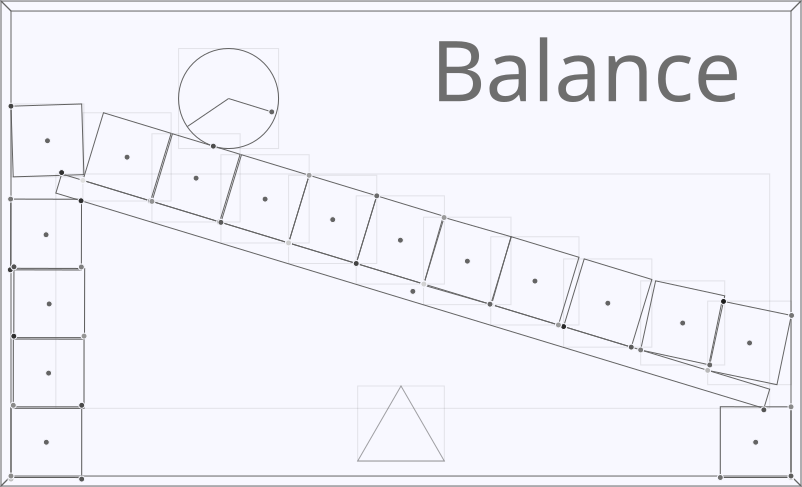

# Balance Physics Engine


**Balance** is a lightweight 2D physics engine with SAT collision detection, sequential impulse solver, and a rich set of joints.

It is fully implemented in **PascalABC.NET**, has **zero external dependencies**, and remains completely **independent** of the rendering backend.

<p align="center">
   
</p>


## Features

* **Rigid Body Dynamics** – Mass, inertia, forces, torque, linear/angular damping.
* **Basic Shapes** – Convex Polygons and Circles.
* **Compound Shapes** – `ShapeGroup` for composite bodies, which includes methods to generate hollow/extruded geometry. `ShapeGroup` is stored inside the `RigidBody`.
* **Collision Detection** – Extended SAT (Separating Axis Theorem) with Sutherland-Hodgman edge clipping for full contact manifold generation.
* **Collision Solver** – Iterative sequential impulse solver covering velocity resolution, Coulomb friction, K-matrix effective mass, and mixed material properties.
* **Stabilization** – Isolated pseudo-impulses (`ps`) designed to adjust positions without extra energy injection.
* **Warm Starting** – Advanced impulse caching driven by a `ContactManager` with automatic lifetime-based cleanup. It pairs body memory addresses with geometric features (vertices, edges) to track contact interaction across frames.
* **Soft mode for constraints** – Advanced constraint compliance driven by a `ComplianceSpec`, supporting hard, soft, and custom modes. In soft mode, the resolution error (`bias`) is directed into the impulse layer, while in hard mode, it goes into the pseudo-impulse layer.
* **Atomic Constraints** – Low-level fundamental primitives instead of monolithic structures, split into geometric constraints (`PointConstraint`, `DistanceConstraint`, `LineConstraint`, `AngleConstraint`) and motor constraints (`LineMotor`, `AngleMotor`). Geometric constraints support target intervals rather than fixed values.
* **Joints** – High-level containers aggregating **atomic constraints** to form complex physical connections. The engine provides well-known specializations like `DistanceJoint`, `RevoluteJoint`, and `LineJoint`, as well as a flexible `GenericJoint` for building custom composite connections.
* **Joints Factory** – A static `Joints` class providing ready-to-use, easily configurable presets for standard mechanical connections. These include solutions for free-compressing ropes (`Rope`), torsional springs (`AngSpring`), motorized pistons (`Piston`), or shock absorbers (`Absorber`), and more.
* **Collision Families** – A filtering system that groups bodies into distinct families to separate colliding and non-colliding object groups, managed by a `ColFamilyManager`. For each family, positive IDs enable internal collisions and negative IDs disable them, while a zero ID means behavior that depends on another system (typically a bitmap mask, which is not implemented yet).
* **Fixed Timestep** – A deterministic time-stepping mechanism managed by a `TimeTicker`. The `PhysWorld` provides a low-level `step` method for executing single updates with a custom delta time, alongside a high-level `simulate` method that synchronizes real-world elapsed time with the physics simulation time. `TimeTicker` accepts a target world update frequency and, on each update, carries over the fractional time remainder to the next frame.
* **Camera and Viewport** – A space transformation subsystem managed by `Camera` and `Viewport` to perform the world-to-screen pipeline. The `Camera` stores the world `Transform` and `zoom`. The `Viewport` resolves bidirectional conversions (`to_screen`/`to_world`) and provides four adaptive scaling modes via `ViewportResizeMode` to handle window resizing (Fixed Zoom, Fixed World, Fixed Width, and Fixed Height).
* **Materials** – Physical properties (friction, restitution, density) driven by a `Material` structure. Each `RigidBody` holds its own material, automatically computing mass and inertia based on geometric area unless an explicit custom_mass is provided.

## Limitations

* **Broad Phase** – The current broad-phase collision detection simply iterates through all pairs of bodies to check their AABB, which leads to $O(N^2)$ time and limits performance with large body counts.
* **Continuous Collision Detection (CCD)** – Fast-moving bodies may suffer from the tunneling effect, passing straight through thin geometry. As a quick workaround, the maximum velocity of bodies can be clamped.
* **Event System** – For gameplay logic, it is important to receive callbacks when physical bodies reach certain states (e.g., when they collide). This feature is currently not implemented.

## Quick Start

* Download and install the latest version of [PascalABC.NET](https://pascalabc.net/)

* Clone the Repository

  ```bash
  git clone https://github.com/Pavel314/balance.git
  cd balance
  ```

* Open and run `demos_wpf.pas`, which provides various showcases of interactive scenes designed for the `GraphWPF` backend.

This setup is sufficient for standard engine integration. For modifying internal logic or regenerating build artifacts, see [this section](#advanced-build-script--meta-generation)


## Advanced: Build Script & Meta-Generation

For engine source code modification or architecture analysis, the repository provides an automated meta-generation utility: `balance_build_script.pas`. This script uses .NET Reflection to inspect the engine's assemblies and serves two main purposes:

### 1. Building the Facade (`balance.pas`)
Modifications to the engine source code require an update to the top-level facade. The script automatically compiles all necessary modules and regenerates a unified `balance.pas` facade with global type aliases and function synonyms.

### 2. Exporting API Signatures (`balance_api.txt`)
Designed to generate API signatures for quick reference, this component extracts all public member declarations (e.g., classes, methods, properties) into a modern Pascal-like syntax. The resulting file provides an interface reference sheet for instant inspection, which can be directly used for AI consultation.


### Usage

Executing the script without arguments automatically builds both the `balance.pas` and `balance_api.txt` artifacts. For more detailed information about command line arguments, compile and run the utility as follows:

```bash
balance_build_script -h
```

## MiniFAQ

### 1. Why was PascalABC.NET chosen?
Using PascalABC.NET is my way of showing gratitude to the language and its ecosystem, where my journey began many years ago. In those early days, I wrote my very first lines of code in the original Delphi-based PascalABC interpreter. Before long, I moved on to PascalABC.NET.
That invaluable experience gradually built a solid foundation in statically-typed languages, which later allowed me to learn a wide range of languages and technologies, including C#, C++, C, and Python. Building **Balance** on PascalABC.NET is a tribute to the tool that started it all.

### 2. How stable is the API?
The general architecture and core interfaces are well-defined, but the API is not yet frozen. Breaking changes are expected as the engine evolves. For any project, it is highly recommended to pin it to a specific commit.

### 3. Why is the standard `Controls.pas` module included in the repository?
It is entirely possible that the PascalABC.NET community will introduce breaking API changes to the `Controls.pas` module over time. Keeping a local copy in this repository shields the demo codebase from those changes.

### 4. Can I open an Issue, submit a PR, or ask a question?
Sure. Feel free to ask questions, open issues, or propose improvements. Community contributions, feedback, and external code reviews are highly valued and always welcome.

## License

This project is licensed under the [MIT License](LICENSE).